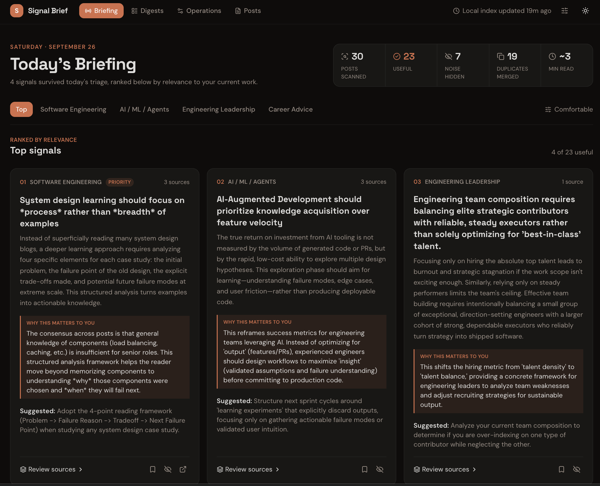

# feed-digester

A local-first tool that collects your LinkedIn feed, filters the noise,
classifies and summarizes what's left, and produces a short daily digest
instead of an infinite scroll.

See `docs/spec.md` for the original brief, `docs/project-memory.md` for the
current architecture and mental model, `docs/decisions.md` for why it's
built this way, and `docs/plan.md` for the slice-by-slice build log. (Early
on, two differently-cased paths for this same tracker — `plan.md` and
`PLAN.md` — collided on macOS's case-insensitive filesystem and destroyed the
originally-approved architecture doc; see the warning at the top of
`docs/plan.md`. All docs now live under one lowercase `docs/` tree to avoid
repeating that.)



## ⚠️ Before you use this

This tool automates a logged-in browser session against **your own LinkedIn
account** to read your own feed. It:

- runs **read-only**: it never likes, comments, follows, connects, or sends
  automated requests, and it only ever clicks "see more" to expand a post;
- does **not** attempt to evade LinkedIn's bot detection — no stealth
  plugins, no fingerprint or user-agent spoofing, no CAPTCHA solving;
- paces itself like a human (randomized scroll/pause timing, capped run
  length and posts-per-run, a daily run cap) and stops the moment it sees a
  login wall or CAPTCHA, rather than trying to push through it.

None of that makes it compliant with LinkedIn's Terms of Service, which
generally prohibit automated access. **You are responsible for deciding
whether to run this against your account and for any consequences —
including account restriction — of doing so.** Consider using a secondary
account, which is what the default `collector` browser profile is for.

## Requirements

- Node.js `>=24` (`.nvmrc` pins **26**; if you use `nvm`, `nvm use`)
- [pnpm](https://pnpm.io) via Corepack: `corepack enable && corepack prepare pnpm@latest --activate`
- [Ollama](https://ollama.com), running locally, with `gemma4` and
  `embeddinggemma` pulled (`ollama pull gemma4`, `ollama pull embeddinggemma`)
- Google Chrome installed (the collector drives it via Playwright with
  `channel: 'chrome'`, not the bundled Chromium)

## Setup

```bash
pnpm install
cp .env.example .env.local   # fill in as needed; GROQ_API_KEY is optional
pnpm dev                     # runs both the web dashboard and the worker process
```

Open http://localhost:3000.

## Scripts

| Command                                   | Does                                                                           |
| ----------------------------------------- | ------------------------------------------------------------------------------ |
| `pnpm dev`                                | Web dashboard + worker together, via `concurrently`                            |
| `pnpm dev:web` / `dev:worker`             | Either process alone                                                           |
| `pnpm build` / `start`                    | Production build / run it (`start:web`, `start:worker` alone)                  |
| `pnpm test` / `test:watch`                | Vitest suite once, or in watch mode                                            |
| `pnpm lint`                               | ESLint                                                                         |
| `pnpm typecheck`                          | `tsc --noEmit`                                                                 |
| `pnpm format` / `format:check`            | Prettier                                                                       |
| `pnpm db:generate` / `db:migrate`         | Generate/run Drizzle migrations                                                |
| `pnpm login`                              | Opens the collector's Chrome profile headed, for a manual login                |
| `pnpm collect:fixtures` / `diagnose:feed` | Collector-development tooling against saved/live HTML                          |
| `pnpm compare:classifiers`                | Dumps both classifiers' output over collected posts to JSON (no labels needed) |
| `pnpm evaluate:classifiers`               | Precision/recall/F1 for both classifiers against labels saved in `/posts`      |

## Where things live

- `app/` — Next.js routes only (pages, route handlers, Server Actions); no
  pipeline logic.
- `components/`, `lib/` — shadcn/ui components and its `cn()`-style helpers.
- `src/` — everything else: config, db, collector, services, llm, pipeline,
  worker, logging, and `web/` (the `web` process's own DB context and view
  helpers). See `docs/architecture.md` and `docs/project-memory.md`.
- `data/` — gitignored: SQLite database, saved images, logs, HTML snapshots.
- `docs/adr/` — architecture decision records for the departures from `docs/spec.md`.
- `docs/` — all other project documentation (spec, architecture, decisions,
  build journal, session handoff, slice plan, grill Q&A, drafts).

## License

MIT — see `LICENSE`.
