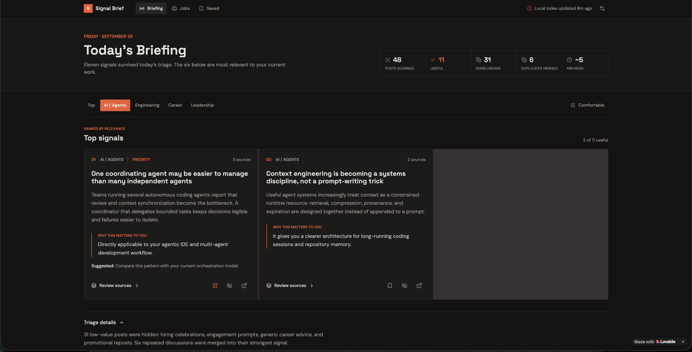
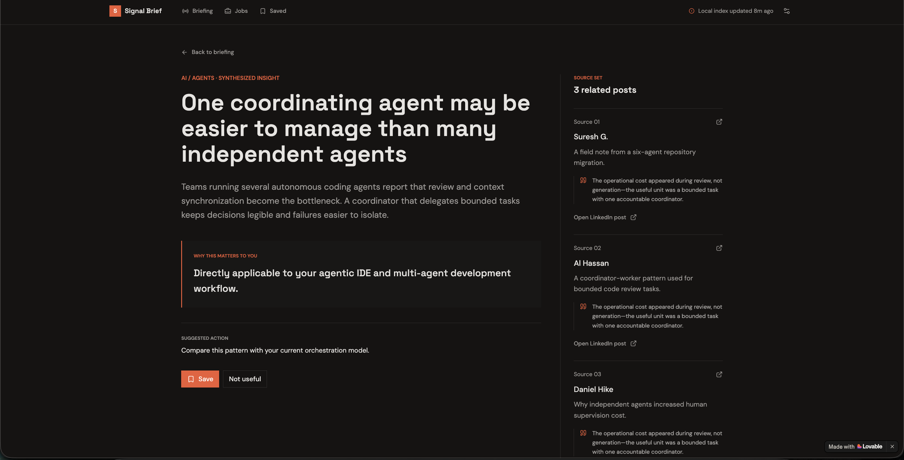

I now have a visual reference for the redesigned product.

REFERENCE UI:
https://id-preview--e019aa0b-f538-4d0b-94a0-95aa49caef7a.lovable.app/

I will also provide screenshots of the reference UI.

Your task is to reproduce this experience inside THIS existing application.

IMPORTANT:

The Lovable project is a DESIGN/UX REFERENCE, not an implementation architecture to copy.

The source of truth for:
- visual hierarchy
- layout
- spacing
- typography
- component appearance
- interaction design
- responsive behavior

is the provided reference UI/screenshots.

The source of truth for:
- architecture
- application logic
- data models
- existing components
- routing
- state management
- APIs
- persistence
- project conventions

is THIS repository.

Do not rewrite the application around Lovable's generated code.

Before implementing:

1. Inspect the current repository.
2. Inspect the existing page/components responsible for the digest UI.
3. Open and inspect the reference URL if browser access is available.
4. Study the supplied screenshots.
5. Identify:
   - reusable existing components
   - components that should be restyled
   - components that should be replaced
   - new components required
6. Produce a short implementation plan.

Then implement the redesign incrementally.

Start with the main Today's Briefing page.

Preserve the product/data changes already implemented around:
- ranked insights
- why-it-matters
- source posts
- filtering/noise removal
- clustering
- jobs

Do not fake data just to reproduce the screenshot if the application already provides equivalent real data. Map the existing data to the new design.

VISUAL FIDELITY

Pay close attention to:
- exact information hierarchy
- content width
- typography scale
- font weights
- line height
- spacing
- alignment
- borders
- surfaces
- color contrast
- card density
- header/navigation
- responsive behavior

Do not loosely interpret the reference into a generic dashboard.

It should visibly resemble the supplied design.

After implementation:

1. Run the application.
2. Capture a screenshot at the same viewport size as the reference.
3. Compare it with the reference screenshot.
4. Identify visible discrepancies.
5. Iterate on CSS/layout.
6. Repeat until the result is reasonably faithful.

Do not make unrelated backend or architectural changes during this task.